# 银行业务管理系统实验报告

##### PB17000215 张博文

## 概述

### 系统目标

<!-- 主要开发目标 -->
实现一个银行业务管理系统，后台 DBMS 使用 MySQL，前端开发工具不限，可以是 C/S 架构也可以是 B/S 架构。要求系统实现时要保证数据之间的一致性、鲁棒性。

### 需求说明

<!-- 主要功能需求 -->
- 客户管理：提供客户所有信息的增、删、改、查功能； 如果客户存在着关联账户或者贷款记录，则不允许删除；
- 账户管理：提供账户开户、销户、修改、查询功能，包括储蓄账户和支票账户； 账户号不允许修改；
- 贷款管理：提供贷款信息的增、删、查功能，提供贷款发放功能； 贷款信息一旦添加成功后不允许修改； 要求能查询每笔贷款的当前状态（未开始发放、发放中、已全部发放） ； 处于发放中状态的贷款记录不允许删除；
- 业务统计：按业务分类（储蓄、 贷款）和时间（月、 季、 年）统计各个支行的业务总金额和用户数， 要求对统计结果同时提供表格和曲线图两种可视化展示方式。

### 本报告的主要贡献

<!-- 报告的主要内容 -->
给出本系统的总体设计和每个模块的设计思路，给出最后的实现和测试结果。

## 总体设计

### 系统模块结构

系统可以分为前端和后端两大模块：
- 后端使用 Django REST Framework，获取和新建数据资源通过 GET, POST 方法访问 `/api/{table_name}/` 实现，修改和删除等操作通过 PUT, DELETE 方法访问 `/api/{table_name}/{primary_key}/` 实现；
- 前端基于开源的 bootstrap 模板实现。通过 JavaScript 访问后端对应的 URL 获取数据资源并渲染，同时将新建、修改和删除的数据通过访问对应的 URL 实现。业务统计功能在获取数据之后，分别用 dataTables 和 chart.js 实现。

#### 后端

后端的主要文件及对应的功能如下：

```
BankManagement
├── __init__.py
├── admin.py
├── apps.py
├── migrations
├── models.py           # 构建数据库的表结构
├── serializers.py      # 对数据进行序列化操作
├── tests.py
├── urls.py             # 自动 URL 路由
└── views.py            # 根据请求返回对应的数据或者对数据进行对应的操作
```

后端的数据资源放在 `/api/{table_name}/` 中，修改和删除通过访问 `/api/{table_name}/{primary_key}/` 实现。

#### 前端

前端的主要文件及对应的功能如下：

```
BankFrontend
├── __init__.py
├── __pycache__
├── admin.py
├── apps.py
├── migrations
├── models.py
├── templates                           # 模板文件
│   └── BankFrontend
│       ├── dist
│       │   ├── 400.html
│       │   ├── 404.html
│       │   ├── 500.html
│       │   ├── banks.html
│       │   ├── charts.html
│       │   ├── checkaccounts.html
│       │   ├── customers.html
│       │   ├── departments.html
│       │   ├── employees.html
│       │   ├── index.html
│       │   ├── loanreleases.html
│       │   ├── loans.html
│       │   ├── savingaccounts.html
│       │   └── tables.html
│       └── index.html
├── tests.py
├── urls.py                             # 定义前端访问的 URL
└── views.py                            # 访问对应的 URL 时渲染对应的模板并返回
```

前端所需要的静态文件如下：

```
static
├── dist
│   ├── assets
│   │   ├── demo
│   │   └── img
│   ├── css
│   └── js
├── scripts
└── src
    ├── assets
    │   ├── demo
    │   └── img
    ├── js
    ├── pug
    │   ├── layouts
    │   │   └── includes
    │   │       ├── head
    │   │       └── navigation
    │   └── pages
    │       └── includes
    └── scss
        ├── layout
        ├── navigation
        │   └── sidenav
        └── variables
```

模块结构图如下：

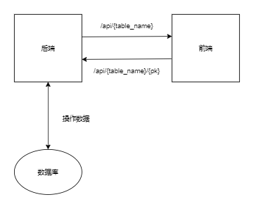

### 系统工作流程

本系统采用前后端分离的设计策略，工作流程示意图如下：


<center>图片来自互联网博客，不包含 APP 部分</center>

### 数据库设计

数据库设计的 ER 图如下：

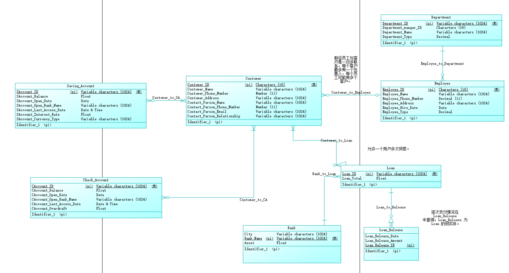

数据库设计的物理数据库结构图如下：

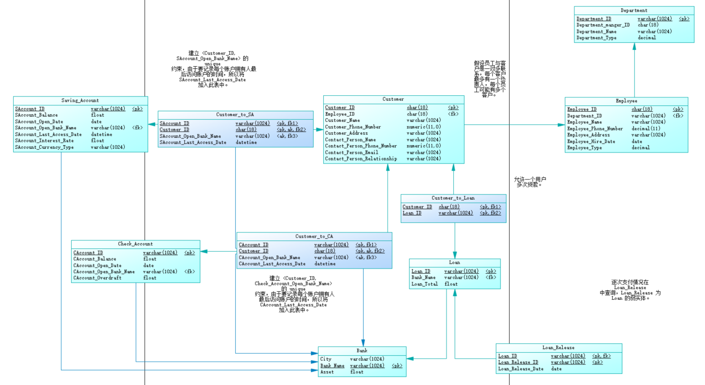

## 详细设计

### 后端

<!-- 给出该模块的输入、输出和程序流程图。 -->
下面根据不同的数据表介绍各模块的设计。

#### Bank

```py
models.py

class Bank(models.Model):
    City = models.CharField('City', max_length=MAX_CHAR_LEN)
    Bank_Name = models.CharField('Bank_Name', primary_key=True, blank=False, max_length=MAX_CHAR_LEN)
    Asset = models.FloatField('Asset', default=0.0, blank=False)

    class Meta:
        db_table = 'Bank'
```

```py
serializers.py

class BankSerializer(serializers.ModelSerializer):
    class Meta:
        model = Bank
        fields = ('City', 'Bank_Name', 'Asset')
```

银行的数据提前插入（在 `views.py` 的 `init` 函数实现，之前使用 GET 方法访问 `/init` url 可以实现初始化数据。目前初始化完成之后已删除此 url，不过函数仍然保留），本次实验系统不实现维护，所以在插入数据之后，设计为只读模式。使用 GET 方法请求之后会返回数据库内的 Bank 数据。

```py
views.py

class BankViewSet(viewsets.ReadOnlyModelViewSet):
    permission_classes = (AllowAny,)
    queryset = Bank.objects.all()
    serializer_class = BankSerializer
```

#### Department

```py
models.py

class Department(models.Model):
    Department_ID = models.CharField('Department_ID', primary_key=True , max_length=MAX_CHAR_LEN, blank=False)
    Department_Manger_ID = models.DecimalField('Department_Manger_ID', max_digits=18, decimal_places=0, blank=False)
    Department_Name = models.CharField('Department_Name', max_length=MAX_CHAR_LEN, blank=False)
    Department_Type = models.IntegerField('Department_Type', blank=False)

    Bank_Name = models.ForeignKey(Bank, on_delete=models.CASCADE)

    class Meta:
        db_table = 'Department'
```

关于 `Department_Type` 的定义如下：`Department_Type: {0: 'Sale', 1: 'Finance', 2: 'Mangement'}`.

```py
serializers.py

class DepartmentSerializer(serializers.ModelSerializer):
    class Meta:
        model = Department
        fields = ('Department_ID', 'Department_Manger_ID',
                  'Department_Name', 'Department_Type', 'Bank_Name')
```

Department 数据提前插入，本次实验系统不实现维护，所以在插入数据之后，设计为只读模式。使用 GET 方法请求之后会返回数据库内的 Department 数据。

```py
views.py

class DepartmentViewSet(viewsets.ReadOnlyModelViewSet):
    permission_classes = (AllowAny,)
    queryset = Department.objects.all()
    serializer_class = DepartmentSerializer
```

#### Employee

```py
models.py

class Employee(models.Model):
    Employee_ID = models.CharField('Employee_ID', max_length=18, primary_key=True)
    Employee_Name = models.CharField('Employee_Name', max_length=MAX_CHAR_LEN, blank=False)
    Employee_Phone_Number = models.DecimalField('Employee_Phone_Number', max_digits=11, decimal_places=0, blank=False)
    Employee_Address = models.CharField('Employee_Address', max_length=MAX_CHAR_LEN, blank=False)
    Employee_Hire_Date = models.DateTimeField('Employee_Hire_Date', blank=False)
    Employee_Type = models.IntegerField('Employee_Type', blank=False)
    
    Bank_Name = models.ForeignKey(Bank, on_delete=models.CASCADE)
    Department_ID = models.ForeignKey(Department, on_delete=models.CASCADE)

    class Meta:
        db_table = 'Employee'
```

其中，关于 `Employee_Type`，定义如下：`Employee_Type: {0: 'Manger', 1: 'general staff'}`.

```py
serializers.py

class EmployeeSerializer(serializers.ModelSerializer):
    class Meta:
        model = Employee
        fields = ('Employee_ID', 'Employee_Name',
                  'Employee_Phone_Number', 'Employee_Address', 'Employee_Hire_Date', 'Employee_Type', 'Bank_Name', 'Department_ID')
```

Employee 数据提前插入，本次实验系统不实现维护，所以在插入数据之后，设计为只读模式。使用 GET 方法请求之后会返回数据库内的 Employee 数据。

```py
views.py

class EmployeeViewSet(viewsets.ReadOnlyModelViewSet):
    permission_classes = (AllowAny,)
    queryset = Employee.objects.all()
    serializer_class = EmployeeSerializer
```

#### CheckAccount

```py
models.py

class CheckAccount(models.Model):
    CAccount_ID = models.CharField('CAccount_ID', primary_key=True, max_length=MAX_CHAR_LEN)
    CAccount_Balance = models.DecimalField('CAccount_Balance', max_digits=20, decimal_places=2, blank=False)
    CAccount_Open_Date = models.DateTimeField('CAccount_Open_Date', blank=False)
    CAccount_Overdraft = models.DecimalField('CAccount_Overdraft', max_digits=20, decimal_places=2, blank=False)

    CAccount_Open_Bank_Name = models.ForeignKey(Bank, on_delete=models.CASCADE)

    class Meta:
        db_table = 'CheckAccount'
```

支票账户的开户时间由服务器端根据当前的时间自动填入。

```py
serializers.py

class CheckAccountSerializer(serializers.ModelSerializer):
    class Meta:
        model = CheckAccount
        fields = ('CAccount_ID', 'CAccount_Balance', 'CAccount_Open_Date',
                  'CAccount_Overdraft', 'CAccount_Open_Bank_Name')
```

支票账户支持增删改查。删除修改需要输入主键。创建过程不仅涉及 `CheckAccount`，还和 `CustomerToCA` 有关。创建过程还需要额外输入客户 `Customer_ID`，同时在 `CustomerToCA` 的表中创建对应的数据。由于创建、修改和删除功能中可能会涉及多个表或者有多次操作，为了保证数据库的一致性，全部使用事务实现。增删改查过程中涉及外键操作会进行检查，保证数据一致性。如果输入数据不符合要求，返回 400；对不存在的数据进行操作，返回 404；创建成功则返回 201.

```py
views.py

class CheckAccountViewSet(viewsets.ModelViewSet):
    '''
    Viewset for check account
    '''
    permission_classes = (AllowAny,)

    def list(self, request):
        queryset = CheckAccount.objects.all()
        serializer = CheckAccountSerializer(queryset, many=True)
        return Response(serializer.data)
    
    @transaction.atomic
    def create(self, request):
        checkaccount = request.data.copy()
        
        try:
            checkaccount.pop('Customer_ID')
        except KeyError as e:
            return Response({
                'status': 'Failed',
                'message': 'Customer_ID is required'}, status=status.HTTP_400_BAD_REQUEST)

        ca_to_customer = request.data.copy()
        
        try:
            ca_to_customer.pop('CAccount_Balance')
            ca_to_customer.pop('CAccount_Overdraft')
        except KeyError as e:
            return Response({
                'status': 'Failed',
                'message': 'More information is required'}, status=status.HTTP_400_BAD_REQUEST)
        
        queryset = Customer.objects.filter(pk=request.data.get('Customer_ID'))
        if not queryset.exists():
            return Response({
                'status': 'Failed',
                'message': 'Customer not exist'}, status=status.HTTP_400_BAD_REQUEST)
        
        try:
            with transaction.atomic():
                checkaccount['CAccount_Open_Date'] = datetime.datetime.now()
                ca_serializer = CheckAccountSerializer(data=checkaccount)

                if ca_serializer.is_valid():
                    CheckAccount.objects.create(**ca_serializer.validated_data)

                    ca_to_customer['CAccount_Last_Access_Date'] = datetime.datetime.now()

                    ca_to_customer_serializer = CustomerToCASerializer(data=ca_to_customer)
                    if ca_to_customer_serializer.is_valid():
                        CustomerToCA.objects.create(**ca_to_customer_serializer.validated_data)
                        # except IntegrityError as e:
                        #     queryset = CheckAccount.objects.all()
                        #     checkaccount = get_object_or_404(queryset, pk=request.data.get('CAccount_ID'))
                        #     checkaccount.delete()
                        #     return Response({
                        #         'status': 'Bad request',
                        #         'message': str(e),
                        #     }, status=status.HTTP_400_BAD_REQUEST)
                        
        except IntegrityError as e:
            return Response({
                'status': 'Bad request',
                'message': str(e),
                }, status=status.HTTP_400_BAD_REQUEST)

        return Response({
            'status': 'Success',
            'message': 'Create new Check Account Successfully'}, status=status.HTTP_201_CREATED)

    def retrieve(self, request, pk=None):
        queryset = CheckAccount.objects.all()
        checkaccount = get_object_or_404(queryset, pk=pk)
        serializer = CheckAccountSerializer(checkaccount)
        return Response(serializer.data)

    @transaction.atomic
    def update(self, request, pk=None):
        # Only balance and overdraft are allowed to modify
        queryset = CheckAccount.objects.filter(pk=pk)
        if not queryset.exists():
            return Response({
                'status': 'Failed',
                'message': 'Check Account not exist'}, status=status.HTTP_400_BAD_REQUEST)
        if pk != request.data.get("CAccount_ID"):
            return Response({
                'status': 'Failed',
                'message': 'Could not change CAccount_ID'}, status=status.HTTP_400_BAD_REQUEST)
        try:
            with transaction.atomic():
                queryset.update(
                    CAccount_ID=pk,
                    CAccount_Balance=request.data.get('CAccount_Balance') if request.data.get('CAccount_Balance') else queryset[0].CAccount_Balance,
                    CAccount_Overdraft=request.data.get('CAccount_Overdraft') if request.data.get('CAccount_Overdraft') else queryset[0].CAccount_Overdraft,
                )
                queryset = CustomerToCA.objects.filter(CAccount_ID=pk)
                queryset.update(
                    CAccount_Last_Access_Date=datetime.datetime.now()
                )
        except IntegrityError as e:
            return Response({
                'status': 'Bad request',
                'message': str(e),
            }, status=status.HTTP_400_BAD_REQUEST)
        
        return Response({
            'status': 'Success',
            'message': 'Update Check Account Successfully'}, status=status.HTTP_200_OK)

    @transaction.atomic
    def destroy(self, request, pk=None):
        queryset = CheckAccount.objects.all()
        checkaccount = get_object_or_404(queryset, pk=pk)
        queryset = CustomerToCA.objects.all()
        customer_to_ca = get_list_or_404(queryset, CAccount_ID=pk)
        try:
            with transaction.atomic():
                for obj in customer_to_ca:
                    obj.delete()
                checkaccount.delete()
            return Response({
            'status': 'Success',
            'message': 'Delete Check Account Successfully'}, status=status.HTTP_200_OK)
        except IntegrityError as e:
            return Response({
                'status': 'Bad request',
                'message': str(e),
            }, status=status.HTTP_400_BAD_REQUEST)
        
        return Response({
            'status': 'Success',
            'message': 'Delete Check Account Successfully'}, status=status.HTTP_200_OK)
```

#### SavingAccount

```py
models.py

class SavingAccount(models.Model):
    SAccount_ID = models.CharField('SAccount_ID', primary_key=True, max_length=MAX_CHAR_LEN)
    SAccount_Balance = models.DecimalField('SAccount_Balance', max_digits=20, decimal_places=2, blank=False)
    SAccount_Open_Date = models.DateTimeField('SAccount_Open_Date', blank=False)
    SAccount_Interest_Rate = models.DecimalField('SAccount_Interest_Rate', max_digits=20, decimal_places=2, blank=False)
    SAccount_Currency_Type = models.CharField('SAccount_Currency_Type', max_length=MAX_CHAR_LEN, blank=False)

    SAccount_Open_Bank_Name = models.ForeignKey(Bank, on_delete=models.CASCADE)

    class Meta:
        db_table = 'SavingAccount'
```

储蓄账户的开户时间由服务器端根据当前的时间自动填入。

```py
serializers.py

class SavingAccountSerializer(serializers.ModelSerializer):
    class Meta:
        model = SavingAccount
        fields = ('SAccount_ID', 'SAccount_Balance', 'SAccount_Open_Date',
                'SAccount_Interest_Rate', 'SAccount_Currency_Type', 'SAccount_Open_Bank_Name')
```

储蓄账户支持增删改查。删除修改需要输入主键。创建过程不仅涉及 `SavingAccount`，还和 `CustomerToSA` 有关。创建过程还需要额外输入客户 `Customer_ID`，同时在 `CustomerToSA` 的表中创建对应的数据。由于创建、修改和删除功能中可能会涉及多个表或者有多次操作，为了保证数据库的一致性，全部使用事务实现。增删改查过程中涉及外键操作会进行检查，保证数据一致性。如果输入数据不符合要求，返回 400；对不存在的数据进行操作，返回 404；创建成功则返回 201.

```py
views.py

class SavingAccountViewSet(viewsets.ViewSet):
    '''
    Viewset for saving account
    '''
    permission_classes = (AllowAny,)

    def list(self, request):
        queryset = SavingAccount.objects.all()
        serializer = SavingAccountSerializer(queryset, many=True)
        return Response(serializer.data)

    def create(self, request):
        savingaccount = request.data.copy()

        try:
            savingaccount.pop('Customer_ID')
        except KeyError as e:
            return Response({
                'status': 'Failed',
                'message': 'Customer_ID is required'}, status=status.HTTP_400_BAD_REQUEST)
        try:
            sa_to_customer = request.data.copy()
            sa_to_customer.pop('SAccount_Balance')
            sa_to_customer.pop('SAccount_Interest_Rate')
            sa_to_customer.pop('SAccount_Currency_Type')
        except KeyError as e:
            return Response({
                'status': 'Failed',
                'message': 'More information is required'}, status=status.HTTP_400_BAD_REQUEST)
        
        queryset = Customer.objects.filter(
            pk=request.data.get('Customer_ID'))
        if not queryset.exists():
            return Response({
                'status': 'Failed',
                'message': 'Customer not exist'}, status=status.HTTP_406_NOT_ACCEPTABLE)
        
        savingaccount['SAccount_Open_Date'] = datetime.datetime.now()
        sa_serializer = SavingAccountSerializer(data=savingaccount)

        try:
            with transaction.atomic():
                if sa_serializer.is_valid():
                    SavingAccount.objects.create(**sa_serializer.validated_data)
                    sa_to_customer['SAccount_Last_Access_Date'] = datetime.datetime.now()

                    sa_to_customer_serializer = CustomerToSASerializer(
                        data=sa_to_customer)
                    if sa_to_customer_serializer.is_valid():
                        CustomerToSA.objects.create(
                        **sa_to_customer_serializer.validated_data)
        except IntegrityError as e:
            return Response({
                'status': 'Bad request',
                'message': str(e),
            }, status=status.HTTP_400_BAD_REQUEST)
        
        return Response({
            'status': 'Success',
            'message': 'Create new Saving Account Successfully'}, status=status.HTTP_201_CREATED)

    def retrieve(self, request, pk=None):
        queryset = SavingAccount.objects.all()
        savingaccount = get_object_or_404(queryset, pk=pk)
        serializer = SavingAccountSerializer(savingaccount)
        return Response(serializer.data)
    
    @transaction.atomic
    def update(self, request, pk=None):
        # Only balance and overdraft are allowed to modify
        queryset = SavingAccount.objects.filter(pk=pk)
        if not queryset.exists():
            return Response({
                'status': 'Failed',
                'message': 'Check Account not exist'}, status=status.HTTP_400_BAD_REQUEST)
        if pk != request.data.get("SAccount_ID"):
            return Response({
                'status': 'Failed',
                'message': 'Could not change SAccount_ID'}, status=status.HTTP_400_BAD_REQUEST)
        try:
            with transaction.atomic():
                queryset.update(
                    SAccount_ID=pk,
                    SAccount_Balance=request.data.get('SAccount_Balance') if request.data.get('SAccount_Balance') else queryset[0].SAccount_Balance,
                    SAccount_Interest_Rate=request.data.get('SAccount_Interest_Rate') if request.data.get('SAccount_Interest_Rate') else queryset[0].SAccount_Interest_Rate,
                    SAccount_Currency_Type=request.data.get('SAccount_Currency_Type') if request.data.get('SAccount_Currency_Type') else queryset[0].SAccount_Currency_Type,
                )
                queryset = CustomerToSA.objects.filter(SAccount_ID=pk)
                queryset.update(
                    SAccount_Last_Access_Date=datetime.datetime.now()
                )
        except IntegrityError as e:
            return Response({
                'status': 'Bad request',
                'message': str(e),
            }, status=status.HTTP_400_BAD_REQUEST)
        
        return Response({
            'status': 'Success',
            'message': 'Update Check Account Successfully'}, status=status.HTTP_200_OK)
    
    @transaction.atomic
    def destroy(self, request, pk=None):
        queryset = SavingAccount.objects.all()
        savingaccount = get_object_or_404(queryset, pk=pk)
        queryset = CustomerToSA.objects.all()
        customer_to_sa = get_list_or_404(queryset, SAccount_ID=pk)
        try:
            with transaction.atomic():
                for obj in customer_to_sa:
                    obj.delete()
                savingaccount.delete()
        except IntegrityError as e:
            return Response({
                'status': 'Bad request',
                'message': str(e),
            }, status=status.HTTP_400_BAD_REQUEST)
        return Response({
            'status': 'Success',
            'message': 'Delete Saving Account Successfully'}, status=status.HTTP_200_OK)
```

#### Customer

```py
models.py

class Customer(models.Model):
    Customer_ID = models.CharField('Customer_ID', primary_key=True, max_length=18)
    Customer_Name = models.CharField('Customer_Name', max_length=MAX_CHAR_LEN, blank=False)        
    Customer_Phone_Number = models.DecimalField('Customer_Phone_Number', max_digits=11, decimal_places=0, blank=False)
    Customer_Address = models.CharField('Customer_Address', max_length=MAX_CHAR_LEN, blank=False)
    Contact_Person_Name = models.CharField('Contact_Person_Name', max_length=MAX_CHAR_LEN, blank=False)
    Contact_Person_Phone_Number = models.DecimalField('Contact_Person_Name', max_digits=11, decimal_places=0, blank=False)
    Contact_Person_Email = models.CharField('Contact_Person_Email', max_length=MAX_CHAR_LEN, blank=False)
    Contact_Person_Relationship = models.CharField('Contact_Person_Relationship', max_length=MAX_CHAR_LEN, blank=False)

    Employee_ID = models.ForeignKey(Employee, on_delete=models.SET_NULL, blank=True, null=True)

    class Meta:
        db_table = 'Customer'
```

客户信息中的发生联系的银行职工使用外键，可以为空。当职工信息被删除时，客户信息中的对应职工 ID 设为空。

```py
serializers.py

class CustomerSerializer(serializers.ModelSerializer):
    class Meta:
        model = Customer
        fields = ('Customer_ID', 'Customer_Name',
                  'Customer_Phone_Number', 'Customer_Address', 'Contact_Person_Name', 'Contact_Person_Phone_Number', 'Contact_Person_Email', 'Contact_Person_Relationship', 'Employee_ID')
```

客户的信息支持增删改查，删除修改需要输入主键。新建客户成功返回 201，其余成功操作返回 200；如果输入数据不符合要求则返回 400，操作的数据不存在则返回 404，否则返回 500.

```py
views.py

class CustomerViewSet(viewsets.ViewSet):
    '''
    Viewset for customer
    '''
    permission_classes = (AllowAny,)

    def list(self, request):
        queryset = Customer.objects.all()
        serializer = CustomerSerializer(queryset, many=True)
        return Response(serializer.data)
    
    def create(self, request):
        serializer = CustomerSerializer(data=request.data)

        if serializer.is_valid():
            Customer.objects.create(**serializer.validated_data)
            return Response({
                'status': 'Success',
                'message': 'Create new Customer Successfully'}, status=status.HTTP_201_CREATED)
        
        return Response({
            'status': 'Bad request',
            'message': 'Invalid data',
        }, status=status.HTTP_400_BAD_REQUEST)

    def retrieve(self, request, pk=None):
        queryset = Customer.objects.all()
        customer = get_object_or_404(queryset, pk=pk)
        serializer = CustomerSerializer(customer)
        return Response(serializer.data)
    
    @transaction.atomic
    def update(self, request, pk=None):
        queryset = Customer.objects.filter(pk=pk)
        if not queryset.exists():
            return Response({
                'status': 'Failed',
                'message': 'Customer not exist'}, status=status.HTTP_400_BAD_REQUEST)
        if pk != request.data.get("Customer_ID"):
            return Response({
                'status': 'Failed',
                'message': 'Could not change Customer_ID'}, status=status.HTTP_400_BAD_REQUEST)
        if request.data.get('Employee_ID') and not Employee.objects.filter(pk=request.data.get('Employee_ID')).exists():
            return Response({
                'status': 'Failed',
                'message': 'Employee_ID not found'}, status=status.HTTP_400_BAD_REQUEST)
        with transaction.atomic():
            queryset.update(
                Customer_Name=request.data.get("Customer_Name") if request.data.get("Customer_Name") else queryset[0].Customer_Name,
                Customer_Phone_Number=request.data.get("Customer_Phone_Number") if request.data.get("Customer_Phone_Number") else queryset[0].Customer_Phone_Number,
                Customer_Address=request.data.get("Customer_Address") if request.data.get("Customer_Address") else queryset[0].Customer_Address,
                Contact_Person_Name=request.data.get("Contact_Person_Name") if request.data.get("Contact_Person_Name") else queryset[0].Contact_Person_Name,
                Contact_Person_Phone_Number=request.data.get("Contact_Person_Phone_Number") if request.data.get("Contact_Person_Phone_Number") else queryset[0].    Contact_Person_Phone_Number,
                Contact_Person_Email=request.data.get("Contact_Person_Email") if request.data.get("Contact_Person_Email") else queryset[0].Contact_Person_Email,
                Contact_Person_Relationship=request.data.get("Contact_Person_Relationship") if request.data.get("Contact_Person_Relationship") else queryset[0].    Contact_Person_Relationship,
                Employee_ID=request.data.get("Employee_ID") if request.data.get("Employee_ID") else queryset[0].Employee_ID
            )
        return Response({
            'status': 'Success',
            'message': 'Update data Successfully'}, status=status.HTTP_200_OK)
    
    def destroy(self, request, pk=None):
        queryset = Customer.objects.all()
        customer = get_object_or_404(queryset, pk=pk)
        try:
            customer.delete()
        except ProtectedError as e:
            return Response({
                'status': 'Failed',
                'message': 'Could not delete'}, status=status.HTTP_400_BAD_REQUEST)
        return Response({
            'status': 'Success',
            'message': 'Delete data Successfully'}, status=status.HTTP_200_OK)
```

#### CustomerToCA

```py
models.py

class CustomerToCA(models.Model):
    CAccount_Last_Access_Date = models.DateTimeField('CAccount_Last_Access_Date', auto_now=True)

    CAccount_ID = models.ForeignKey(CheckAccount, on_delete=models.CASCADE)
    Customer_ID = models.ForeignKey(Customer, on_delete=models.PROTECT)
    CAccount_Open_Bank_Name = models.ForeignKey(Bank, on_delete=models.CASCADE)

    class Meta:
        db_table = 'CustomerToCA'
        constraints = [
            models.UniqueConstraint(fields=['Customer_ID', 'CAccount_Open_Bank_Name'], name='One customer is only allowed to open one CA in one bank'),
            models.UniqueConstraint(fields=['CAccount_ID', 'Customer_ID'], name='CustomerToCA Fake Primary Key')
        ]
```

这是客户和其支票账户的对应关系。按照要求添加约束：每个客户只能在每个银行开一个支票账户、一个账户可以对应多个拥有者（前端视图默认只为一个账户指定一个拥有者，实际上可以通过构造 POST 请求根据需要进行添加操作，对一个账户添加更多的客户）。最后访问时间由后端自动添加当前时间实现。

```py
serializers.py

class CustomerToCASerializer(serializers.ModelSerializer):
    class Meta:
        model = CustomerToCA
        fields = ('CAccount_ID', 'Customer_ID',
                  'CAccount_Open_Bank_Name', 'CAccount_Last_Access_Date')
```

```py
views.py

class CustomerToCAViewSet(viewsets.ModelViewSet):
    permission_classes = (AllowAny,)
    queryset = CustomerToCA.objects.all()
    serializer_class = CustomerToCASerializer
```

#### CustomerToSA

```py
models.py

class CustomerToSA(models.Model):
    SAccount_Last_Access_Date = models.DateTimeField('SAccount_Last_Access_Date', auto_now=True)

    SAccount_ID = models.ForeignKey(SavingAccount, on_delete=models.CASCADE)
    Customer_ID = models.ForeignKey(Customer, on_delete=models.PROTECT)
    SAccount_Open_Bank_Name = models.ForeignKey(Bank, on_delete=models.CASCADE)

    class Meta:
        db_table = 'CustomerToSA'
        constraints = [
            models.UniqueConstraint(fields=['Customer_ID', 'SAccount_Open_Bank_Name'], name='One customer is only allowed to open one SA in one bank'),
            models.UniqueConstraint(fields=['SAccount_ID', 'Customer_ID'], name='CustomerToSA Fake Primary Key')
        ]
```

这是客户和其储蓄账户的对应关系。按照要求添加约束：每个客户只能在每个银行开一个储蓄账户、一个账户可以对应多个拥有者（前端视图默认只为一个账户指定一个拥有者，实际上可以通过构造 POST 请求根据需要进行添加操作，对一个账户添加更多的客户）。最后访问时间由后端自动添加当前时间实现。

```py
serializers.py

class CustomerToSASerializer(serializers.ModelSerializer):
    class Meta:
        model = CustomerToSA
        fields = ('SAccount_ID', 'Customer_ID',
                  'SAccount_Open_Bank_Name', 'SAccount_Last_Access_Date')
```

```py
views.py

class CustomerToSAViewSet(viewsets.ModelViewSet):
    permission_classes = (AllowAny,)
    queryset = CustomerToSA.objects.all()
    serializer_class = CustomerToSASerializer
```

#### Loan

```py
models.py

class Loan(models.Model):
    Loan_ID = models.CharField('Loan_ID', max_length=MAX_CHAR_LEN, blank=False, primary_key=True)
    Loan_Total = models.DecimalField('Loan_Total', max_digits=20, decimal_places=2, blank=False)
    Loan_Status = models.CharField('Loan_Status', max_length=1, default='0')
    
    Bank_Name = models.ForeignKey(Bank, on_delete=models.CASCADE)

    class Meta:
        db_table = 'Loan'
```

关于 `Loan_Status` 的定义如下：`{'0': 未开始发放, '1': 发放中, '2': 已全部发放}`.

```py
serializers.py

class LoanSerializer(serializers.ModelSerializer):
    class Meta:
        model = Loan
        fields = ('Loan_ID', 'Loan_Total', 'Loan_Status', 'Bank_Name')
```

贷款支持增删查。处于发放状态的贷款不允许删除，删除修改需要输入主键。贷款信息添加成功之后不允许修改。创建过程不仅涉及 `Loan`，还和 `CustomerToLoan` 有关。创建过程还需要额外输入客户 `Customer_ID`，同时在 `CustomerToLoan` 的表中创建对应的数据。创建成功之后默认贷款为未发放状态。由于创建、修改和删除功能中可能会涉及多个表或者有多次操作，为了保证数据库的一致性，全部使用事务实现。增删改查过程中涉及外键操作会进行检查，保证数据一致性。如果输入数据不符合要求，返回 400；对不存在的数据进行操作，返回 404；创建成功则返回 201.

```py
views.py

class LoanViewSet(viewsets.ViewSet):
    '''
    Viewset for loan.
    '''
    permission_classes = (AllowAny,)

    def list(self, request):
        queryset = Loan.objects.all()
        serializer = LoanSerializer(queryset, many=True)
        return Response(serializer.data)

    @transaction.atomic
    def create(self, request):
        loan = request.data.copy()
        try:
            loan.pop('Customer_ID')
        except KeyError as e:
            return Response({
                'status': 'Failed',
                'message': 'Customer_ID is required'}, status=status.HTTP_400_BAD_REQUEST)
        
        customer_to_loan = request.data.copy()
        try:
            customer_to_loan.pop('Loan_Total')
            customer_to_loan.pop('Loan_Status')
            customer_to_loan.pop('Bank_Name')
        except KeyError as e:
            return Response({
                'status': 'Failed',
                'message': 'More information is required'}, status=status.HTTP_400_BAD_REQUEST)
        
        queryset = Customer.objects.filter(pk=request.data.get('Customer_ID'))
        if not queryset.exists():
            return Response({
                'status': 'Failed',
                'message': 'Customer not exist'}, status=status.HTTP_400_BAD_REQUEST)

        serializer = LoanSerializer(data=request.data)

        try:
            with transaction.atomic():
                if serializer.is_valid():
                    Loan.objects.create(**serializer.validated_data)
                    customer_to_loan_serializer = CustomerToLoanSerializer(data=customer_to_loan)
                if customer_to_loan_serializer.is_valid():
                    CustomerToLoan.objects.create(**customer_to_loan_serializer.validated_data)
        except IntegrityError as e:
            return Response({
                'status': 'Bad request',
                'message': str(e),
            }, status=status.HTTP_400_BAD_REQUEST)
            
        return Response({
            'status': 'Success',
            'message': 'Create new Loan Successfully'},
            status=status.HTTP_201_CREATED)
    
    def update(self, request, pk=None):
        return Response({
            'status': 'Bad request',
            'message': 'Loan is not allowed to modify',
        }, status=status.HTTP_400_BAD_REQUEST)

    def retrieve(self, request, pk=None):
        queryset = Loan.objects.all()
        loan = get_object_or_404(queryset, pk=pk)
        serializer = LoanSerializer(loan)
        return Response(serializer.data)
    
    @transaction.atomic
    def destroy(self, request, pk=None):
        queryset = Loan.objects.all()
        loan = get_object_or_404(queryset, pk=pk)
        queryset = CustomerToLoan.objects.all()
        customer_to_loan = get_list_or_404(queryset, Loan_ID=pk)
        if loan.Loan_Status == '1':
            return Response({
                'status': 'Bad request',
                'message': 'A loan record in the issuing state is not allowed to be deleted',
            }, status=status.HTTP_400_BAD_REQUEST)
        
        try:
            with transaction.atomic():
                for obj in customer_to_loan:
                    obj.delete()
                loan.delete()
        except IntegrityError as e:
            return Response({
                'status': 'Bad request',
                'message': str(e),
            }, status=status.HTTP_400_BAD_REQUEST)

        return Response({
            'status': 'Success',
            'message': 'Delete Loan Successfully'}, status=status.HTTP_200_OK)
```

#### CustomerToLoan

```py
models.py

class CustomerToLoan(models.Model):
    Customer_ID = models.ForeignKey(Customer, on_delete=models.PROTECT)
    Loan_ID = models.ForeignKey(Loan, on_delete=models.CASCADE)

    class Meta:
        db_table = 'CustomerToLoan'
        constraints = [
            models.UniqueConstraint(fields=['Loan_ID', 'Customer_ID'], name='Primary key')
        ]
```

这是客户和其贷款的对应关系。按照要求添加约束：一个贷款可以对应多个客户（前端视图默认只为一个贷款指定一个拥有者，实际上可以通过构造 POST 请求根据需要进行添加操作，对一个贷款添加更多的客户）。

```py
serializers.py

class CustomerToLoanSerializer(serializers.ModelSerializer):
    class Meta:
        model = CustomerToLoan
        fields = ('Customer_ID', 'Loan_ID')
```

```py
views.py

class CustomerToLoanViewSet(viewsets.ModelViewSet):
    permission_classes = (AllowAny,)
    queryset = CustomerToLoan.objects.all()
    serializer_class = CustomerToLoanSerializer
```

#### LoanRelease

```py
models.py

class LoanRelease(models.Model):
    Loan_Release_ID = models.CharField('Loan_Release_ID', max_length=MAX_CHAR_LEN, primary_key=True)
    Loan_Release_Date = models.DateTimeField('Loan_Release_Date', blank=False)
    Loan_Release_Amount = models.DecimalField('Loan_Release_Amount', max_digits=20, decimal_places=2, blank=False)

    Loan_ID = models.ForeignKey(Loan, on_delete=models.CASCADE)

    class Meta:
        db_table = 'LoanRelease'
        constraints = [
            models.UniqueConstraint(fields=['Loan_ID', 'Loan_Release_ID'], name='LoanRelease Fake Primary Key')
        ]
```

贷款发放时间由后端自动添加当前时间实现。

```py
serializers.py

class LoanReleaseSerializer(serializers.ModelSerializer):
    class Meta:
        model = LoanRelease
        fields = ('Loan_Release_ID', 'Loan_Release_Date',
                  'Loan_Release_Amount', 'Loan_ID')
```

创建贷款发放的过程中，如果当前已发放金额加本次待发放金额超过贷款金额，则判定为错误，返回 400。每次发放结束之后都根据已发放金额更新贷款发放状态。删除过程用类似的方法实现。为了保证数据库的一致性，创建和删除均使用事务实现。处在发放中的贷款不允许删除贷款发放记录。

```py
views.py

class LoanReleaseViewSet(viewsets.ViewSet):
    '''
    Viewset for loan release
    '''
    permission_classes = (AllowAny,)
    
    def list(self, request):
        queryset = LoanRelease.objects.all()
        serializer = LoanReleaseSerializer(queryset, many=True)
        return Response(serializer.data)
    
    @transaction.atomic
    def create(self, request):
        loan_id = request.data.get('Loan_ID')
        loan = Loan.objects.filter(pk=request.data.get('Loan_ID'))
        
        if not loan.exists():
            return Response({
                'status': 'Failed',
                'message': 'Loan not exist'}, status=status.HTTP_400_BAD_REQUEST)
    
        if loan.get().Loan_Status == '2':
            return Response({
                'status': 'Failed',
                'message': 'Loan is finished'}, status=status.HTTP_400_BAD_REQUEST)

        queryset = LoanRelease.objects.filter(Loan_ID=request.data.get('Loan_ID'))
        loan_amount = sum([q.Loan_Release_Amount for q in queryset])

        if float(loan_amount) + float(request.data.get('Loan_Release_Amount')) > float(loan.get().Loan_Total):
            return Response({
                'status': 'Failed',
                'message': 'Loan release is more than total amount'}, status=status.HTTP_400_BAD_REQUEST)
        newrequest = request.data.copy()
        newrequest['Loan_Release_Date'] = datetime.datetime.now()
        serializer = LoanReleaseSerializer(data=newrequest)
        
        try:
            with transaction.atomic():
                if serializer.is_valid():
                    LoanRelease.objects.create(**serializer.validated_data)
                    queryset = Loan.objects.filter(pk=request.data.get('Loan_ID'))
                    if float(loan_amount) + float(request.data.get('Loan_Release_Amount')) == float(loan.get().Loan_Total):
                        queryset.update(Loan_Status='2')
                    else:
                        queryset.update(Loan_Status='1')
        except IntegrityError as e:       
            return Response({
                'status': 'Bad request',
                'message': 'Invalid data',
            }, status=status.HTTP_400_BAD_REQUEST)
        
        return Response({
            'status': 'Success',
            'message': 'Create new Loan Release Successfully'},
            status=status.HTTP_201_CREATED)
        
    
    def retrieve(self, request, pk=None):
        queryset = LoanRelease.objects.all()
        loan = get_object_or_404(queryset, Loan_Release_ID=pk)
        serializer = LoanReleaseSerializer(loan)
        return Response(serializer.data)

    def update(self, request, pk=None):
        return Response({
            'status': 'Bad request',
            'message': 'Loan Release is not allowed to modify',
        }, status=status.HTTP_400_BAD_REQUEST)
    
    @transaction.atomic
    def destroy(self, request, pk=None):
        queryset = LoanRelease.objects.all()
        loan_release = get_object_or_404(queryset, pk=pk)
        loan = loan_release.Loan_ID

        if loan.Loan_Status == '1':
            return Response({
                'status': 'Bad request',
                'message': 'A loan release record in the issuing state is not allowed to be deleted',
            }, status=status.HTTP_400_BAD_REQUEST)
        
        try:
            with transaction.atomic():
                loan_release.delete()
                queryset = LoanRelease.objects.filter(Loan_ID=loan)
                if not queryset.exists():
                    queryset.update(Loan_Status='0')
                else:
                    loan_amount = sum([q.Loan_Release_Amount for q in queryset])
                    if float(loan_amount) == float(loan.get().Loan_Total):
                        queryset.update(Loan_Status='2')
                    elif float(loan_amount) == 0:
                        queryset.update(Loan_Status='0')
                    else:
                        queryset.update(Loan_Status='1')
        except IntegrityError as e:
            return Response({
                'status': 'Bad request',
                'message': str(e),
            }, status=status.HTTP_400_BAD_REQUEST)
        
        return Response({
            'status': 'Success',
            'message': 'Delete Loan Release Successfully'}, status=status.HTTP_200_OK)
```

#### StatisticalData

通过 GET 方法访问 `/api/statisticaldata/` 可以获得业务统计数据。分别提供各个银行的储蓄、贷款根据时间（月、季、年）的业务总金额和客户数据，方便前端渲染为表格和曲线图数据。

```py
views.py

class StatisticalDataViewSet(viewsets.ViewSet):
    '''
    Viewset for statistical data
    '''
    permission_classes = (AllowAny,)

    def list(self, request):
        bank_set = Bank.objects.all()
        time_list = []
        for bank in bank_set:
            saving_account_set = SavingAccount.objects.filter(SAccount_Open_Bank_Name=bank.Bank_Name)
            overall_balance = 0.00
            for sa in saving_account_set:
                time_list.append(sa.SAccount_Open_Date)
                overall_balance += float(sa.SAccount_Balance)
        start_time = min(time_list)
        now_time = datetime.datetime.now()

        # Process year
        bank_year_data = []
        bank_quarter_data = []
        bank_month_data = []
        quarter_range = [[1, 3], [4, 6], [7, 9], [10, 12]]
        for bank in bank_set:
            tmp = {}
            for year in range(start_time.year, now_time.year + 1):
                saving_account_set = SavingAccount.objects.filter(
                    SAccount_Open_Bank_Name=bank.Bank_Name)
                loan_set = Loan.objects.filter(
                        Bank_Name=bank.Bank_Name)
                overall_balance = 0.00
                overall_loan = 0.00
                overall_customer = 0
                for sa in saving_account_set:
                    if sa.SAccount_Open_Date.year <= year:
                        overall_balance += float(sa.SAccount_Balance)
                        overall_customer += 1
                for ln in loan_set:
                    release_set = LoanRelease.objects.filter(Loan_ID=ln.Loan_ID)
                    for release in release_set:
                        if release.Loan_Release_Date.year <= year:
                            overall_loan += float(release.Loan_Release_Amount)
                tmp[str(year)] = [overall_balance, overall_loan, overall_customer]
            bank_year_data.append(tmp)
        # print(bank_year_data)

        # Process quarter
        for bank in bank_set:
            tmp = {}
            for year in range(start_time.year, now_time.year + 1):
                for quarter in range(1, 5):
                    saving_account_set = SavingAccount.objects.filter(
                        SAccount_Open_Bank_Name=bank.Bank_Name)
                    loan_set = Loan.objects.filter(
                        Bank_Name=bank.Bank_Name)
                    overall_balance = 0.00
                    overall_loan = 0.00
                    overall_customer = 0
                    for sa in saving_account_set:
                        if sa.SAccount_Open_Date.year <= year and quarter_range[quarter-1][0] <= sa.SAccount_Open_Date.month <= quarter_range [quarter-1][1]:
                            overall_balance += float(sa.SAccount_Balance)
                            overall_customer += 1
                    for ln in loan_set:
                        release_set = LoanRelease.objects.filter(Loan_ID=ln.Loan_ID)
                        for release in release_set:
                            if release.Loan_Release_Date.year <= year and quarter_range[quarter-1][0] <= release.Loan_Release_Date.month <= quarter_range [quarter-1][1]:
                                overall_loan += float(release.Loan_Release_Amount)
                    tmp[str(year) + "-Q" + str(quarter)] = [overall_balance, overall_loan, overall_customer]
            bank_quarter_data.append(tmp)
        # print(bank_quarter_data)

        # Process month
        for bank in bank_set:
            tmp = {}
            for year in range(start_time.year, now_time.year + 1):
                for month in range(1, datetime.datetime.now().month + 1):
                    saving_account_set = SavingAccount.objects.filter(
                        SAccount_Open_Bank_Name=bank.Bank_Name)
                    loan_set = Loan.objects.filter(
                        Bank_Name=bank.Bank_Name)
                    overall_balance = 0.00
                    overall_loan = 0.00
                    overall_customer = 0
                    for sa in saving_account_set:
                        if sa.SAccount_Open_Date.year <= year and sa.SAccount_Open_Date.month == month:
                            overall_balance += float(sa.SAccount_Balance)
                            overall_customer += 1
                    for ln in loan_set:
                        release_set = LoanRelease.objects.filter(Loan_ID=ln.Loan_ID)
                        for release in release_set:
                            if release.Loan_Release_Date.year <= year and release.Loan_Release_Date.month == month:
                                overall_loan += float(release.Loan_Release_Amount)
                    tmp[str(year) + "-M" + str(month)] = [overall_balance, overall_loan, overall_customer]
            bank_month_data.append(tmp)
        # print(bank_month_data)

        response_data = {}
        response_data['year_data'] = bank_year_data
        response_data['quarter_data'] = bank_quarter_data
        response_data['month_data'] = bank_month_data

        return Response(response_data)
```

### 前端

前端通过新建一个 Django app 实现。

由于前端的实现不是本次实验的重点，所以在这里只简要介绍一下设计思路：
- 访问对应的 url 时，前端渲染对应模板，之后 JavaScript 会从对应的后端 url 中获取数据并填充；
- 访问 `index.html` 会跳转到 `/dist/index.html`。每个 url 都对应一个 html 文件，静态文件存放在 `static` 文件夹下；
- 对后端 url 的访问都使用 `ajax` 实现，数据展示使用 dataTables 实现，数据统计中的折线图使用 chart.js 实现；
- 使用 `ajax` 得到数据之后，只需要按照 dataTables 和 chart.js 对应的格式就可以展示对应的数据；
- 在统计过程中，只统计对应时间段内的数据总量（比如：第一季度存款量，一月客户数等）。

## 实现与测试

### 实现结果

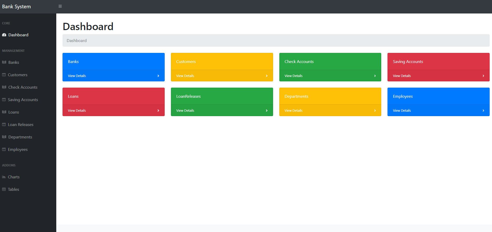

<center>主页</center>

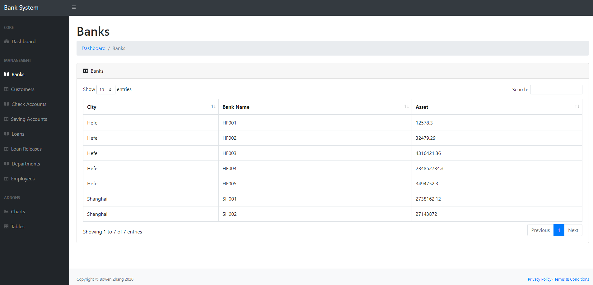

<center>Banks</center>

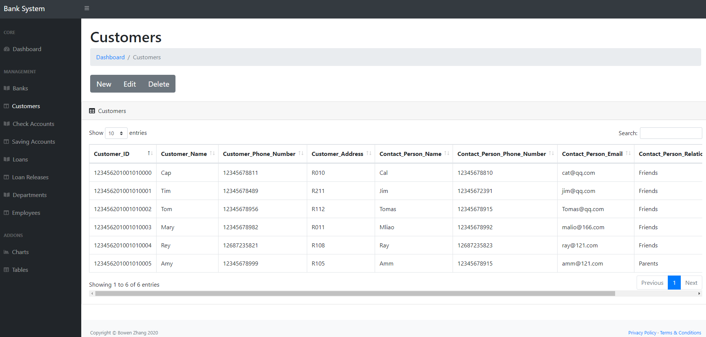

<center>Customers</center>

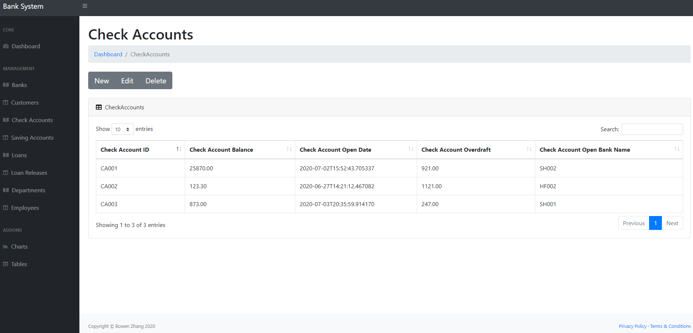

<center>Check Accounts</center>

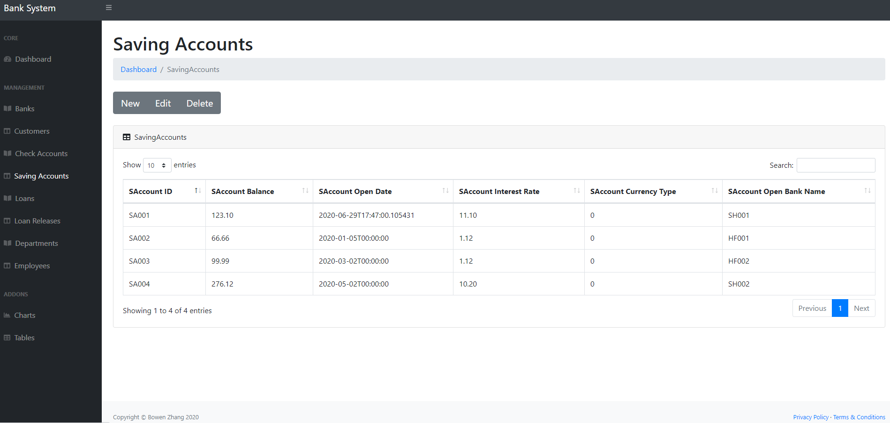

<center>Saving Accounts</center>

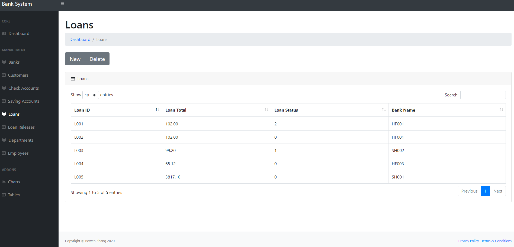

<center>Loans</center>

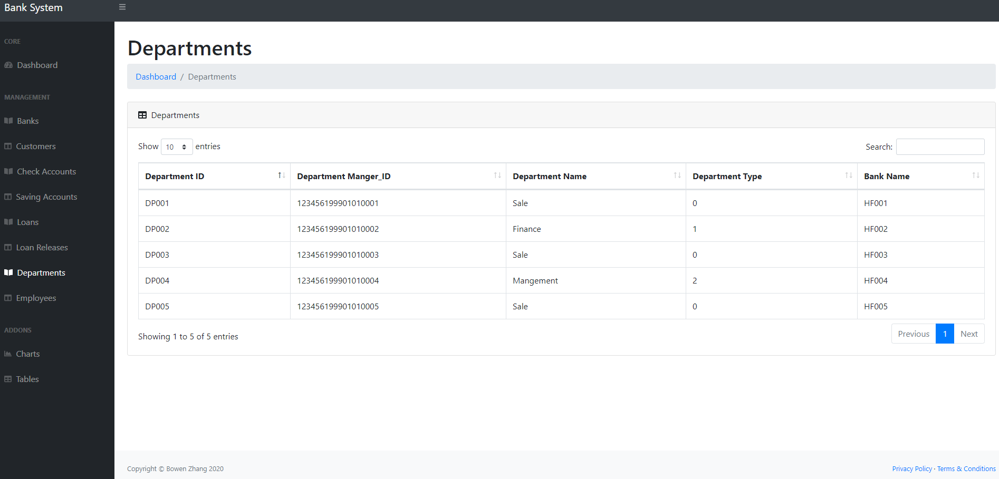

<center>Departments</center>

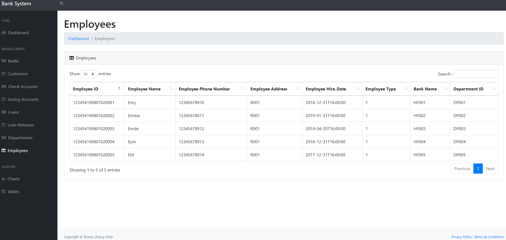

<center>Employees</center>

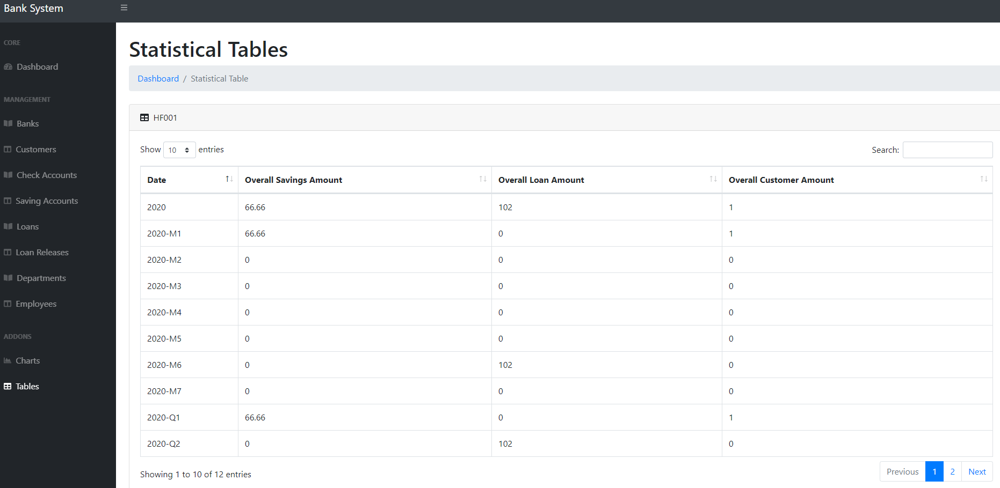

<center>Statistical Tables</center>

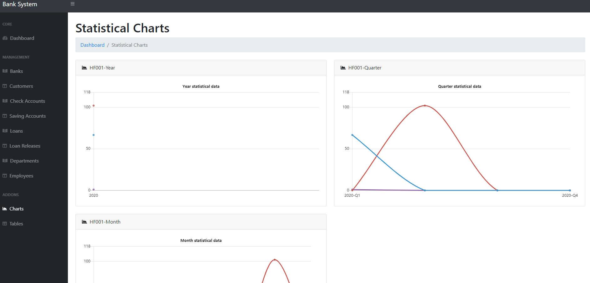

<center>Statistical Charts</center>

### 测试结果

测试用例均已在测试时插入对应的表中，可以参考上面的截图。

## 总结与讨论

收获：
- 在本系统开发过程中体验了一次相对比较完整的前后端分离的 web 应用开发过程；
- 学习了 Django + REST Framework 等目前流行的后端开发思路和开发框架；
- 学习了基于 Bootstrap 模板 + JavaScript 的前端开发过程；
- 根据需求从头开始设计数据库，对数据库的设计过程，以及一致性、完整性等重要性质有了更深刻的理解。

不足之处：
- 前端没有使用目前比较流行的 Vue 等架构实现；
- 前端的部分代码可扩展性比较差，后续使用 Django 的模板循环实现会有更好的拓展性；
- 后端对一个账户对应多个账户的支持不够，前端默认只提供一对一的输入，手动构造 POST 的方法虽然可行，但使用体验略有下降。